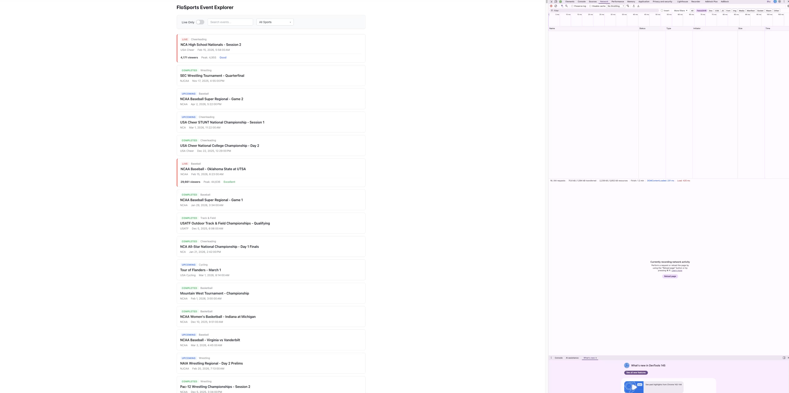

# FloSports Event Explorer

A proof-of-concept event browser for FloSports operations staff. NestJS backend aggregates event data from two sources, Angular frontend provides a filterable UI.

## Demo
[](https://github.com/user-attachments/assets/54b0dd8a-8b13-46c9-ae9c-0c96712ab9fe)

## Setup

```bash
git clone <repo-url>
cd flo-sports
npm install
```

### Run (single command starts both API and frontend)

```bash
npx nx serve client
```

The Angular dev server starts at `http://localhost:4200` and proxies `/api` requests to the NestJS backend on port 3000.

### Run tests

```bash
# All API tests (31 tests)
npx nx test api

# All client tests (29 tests)
npx nx test client --watch=false
```

---

## Assumptions

- **No pagination**: The PRD doesn't mention it. With ~5,000 events this is fine for a POC; for production I'd add cursor-based pagination.
- **Case-insensitive search**: Title search is case-insensitive (e.g., "ncaa" matches "NCAA Wrestling Finals").
- **Debounce timing**: 300ms debounce on the search input to balance responsiveness with request volume.
- **Empty JSON entries**: The provided `flo-events.json` contains 2 empty `{}` objects. The repository filters these out (entries without an `id`).
- **No third-party UI**: All components (toggle, search, dropdown) are built from scratch per the PRD requirement.
- **Filter composition**: Filters are AND-composed — enabling "Live Only" + selecting "Wrestling" shows only live wrestling events.

---

## API Design

Three endpoints under the `/api` global prefix:

| Method | Endpoint | Description |
|--------|----------|-------------|
| GET | `/api/events?sport=X&status=Y&search=Z` | List events with optional filters |
| GET | `/api/events/:id` | Get single event by ID |
| GET | `/api/events/sports` | Get sorted list of unique sport names |

**Response shape** for events:

```json
{
  "id": "evt-0003",
  "title": "NCA High School Nationals - Session 2",
  "sport": "Cheerleading",
  "league": "USA Cheer",
  "status": "live",
  "startTime": "2026-02-15T10:58:00.000Z",
  "liveStats": {
    "eventId": "evt-0003",
    "viewerCount": 4171,
    "peakViewerCount": 4955,
    "streamHealth": "good",
    "lastUpdated": "2026-02-17T23:07:47.146Z"
  }
}
```

The `liveStats` field is only present for events with `status: "live"`. Non-live events omit it entirely.

**Query parameters** are all optional. When omitted, no filter is applied for that dimension.

---

## Data Loading & Merging

**Loading**: The `JsonEventsRepository` reads both JSON files from disk using `fs.readFileSync`. Data is loaded on each request (acceptable for a POC; for production, I'd cache in memory with a TTL or load once on module init).

**Merging**: The `EventsService` builds a `Map<string, LiveStats>` keyed by `eventId` for O(1) lookups, then maps over events attaching stats where available. This is a single pass over each dataset — O(n + m) total.

**What changes for real HTTP upstreams**: The `EventsRepository` is an abstract class (port). `JsonEventsRepository` is the current adapter that reads files. To switch to real upstream services, create an `HttpEventsRepository` that calls the upstream APIs and implements the same interface. Swap the provider in `EventsModule` — no service or controller changes needed. This is the Repository pattern (DDD) with Dependency Inversion (SOLID).

---

## Backend Decisions

**Architecture**: Feature-based module structure within `apps/api/src/events/`:

- `events.repository.ts` — Abstract repository interface (port)
- `json-events.repository.ts` — JSON file adapter (infrastructure)
- `event-filter.strategy.ts` — Pure filter functions (Strategy pattern)
- `events.service.ts` — Application service that orchestrates repository + filters
- `events.controller.ts` — Thin HTTP layer, delegates everything to the service
- `dto/event-filter.dto.ts` — Typed query parameters

**Filtering**: Each filter (status, sport, search) is an independent pure function with a guard clause — if the parameter is undefined, it returns the array unchanged. `applyFilters` composes them sequentially. No nested conditionals.

**Shared types**: All domain interfaces live in `libs/shared` and are imported by both frontend and backend via `@flo-sports/shared`.

---

## Trade-offs

**Prioritized**:
- TDD with red-green-refactor for all business logic (60 total tests)
- Clean separation of concerns (repository/service/controller, infrastructure/presentation)
- Accessibility (ARIA attributes, keyboard navigation, focus management)
- All three filter components built from scratch with proper component architecture

**Skipped (would add with more time)**:
- Pagination / virtual scrolling for the event list
- Caching in the repository (load data once instead of per-request)
- E2E tests with Playwright
- More sophisticated dropdown keyboard navigation (arrow keys to move through options)
- Loading skeleton states instead of plain "Loading..." text
- Swagger/OpenAPI documentation

---

## AI Tools

I used Cursor with Claude as an AI assistant throughout development. It was used for:
- Scaffolding the Nx monorepo structure
- Writing test cases and implementations following TDD
- Generating SCSS styles for the filter components
- Debugging TypeScript strict mode issues (e.g., `export type` for re-exports with `isolatedModules`)

Everything in the repo was reviewed and understood by me. I can explain any decision in detail.

---

## Development Process

Below is a log of the AI-assisted workflow: the prompts I gave, the plans generated, and how Cursor executed on them. This shows my thought process and how I directed the tool.

---

### Prompt 1 — Initial Plan Setup

**My prompt:**

> Please read @assessment especially @assessment/Staff Full Stack PRD.pdf and try to split this entire task into 2-3 point stories.

**Result:** Cursor produced a full implementation plan broken into three stories — [plan.md](artifacts/plan.md)

---

### Prompt 2 — Applying Engineering Principles

**My prompt:**

> 1. We should write any code with TDD
> 2. We should follow @.cursor/rules
> 3. Please use concepts from Martin Fowler Book 2nd edition such as guards and early returns over nested statements
> 4. Write DRY code
> 5. Do not overengineer, do not do YAGNI
> 6. Follow SOLID principles
> 7. Follow Robert C. Martin Clean Code principles (short and self-describing functions, with tests, self-described variables, etc.)
> 8. Make sure all tests are not failing
> 9. Also try to follow design patterns from Gang of Four book and try to design and place code with DDD concept by Eric Evans book

**Cursor asked a clarifying question:**

> The previous plan said "no repository pattern" (YAGNI). But DDD calls for a Repository to abstract data access, and the PRD explicitly asks "What would change if these were real upstream HTTP services instead of files?" — which is exactly what a repository interface solves. Should we add a lightweight EventsRepository interface + JsonEventsRepository implementation (DDD/Dependency Inversion), or keep data loading directly in the service (simpler but less DDD)?

**My answer:** Yes, add lightweight Repository (DDD-aligned, answers the PRD question directly).

**What changed in the plan:**

- **Guiding Principles** section added — TDD (red-green-refactor strictly), Clean Code, SOLID, DRY, guards/early returns, and an explicit YAGNI list
- **Story 1 (Backend)** — exact TDD sequence: 8 tests for the service, 4 for the controller, written before implementation. Pure filter functions with guard clauses. Thin controller. `EventFilterDto` for typed query params
- **Story 2 (Frontend)** — exact TDD sequence per component (toggle: 3 tests, search: 4, dropdown: 7, filter bar: 4). Angular signals for state. OnPush change detection. Feature-based folder structure
- **Story 3 (Polish)** — integration verification, error handling edge cases, README with all 7 PRD-required sections

All three stories follow the same discipline: tests first, no overengineering, self-describing code, short functions, early returns.

---

### Prompt 3 — Build Plan

**My prompt:**

> Build Plan [plan.md](artifacts/plan.md)

**How Cursor executed:**

Cursor worked through all three stories sequentially, following TDD throughout:

**Story 1 — Backend (31 tests, all green)**
- Shared domain types in `libs/shared`: `FloEvent`, `LiveStats`, `EventWithStats`, `EventFilterParams`, status/health types
- `EventsRepository` abstract class (port) + `JsonEventsRepository` (adapter) — DDD Repository pattern with DI
- `event-filter.strategy.ts` — pure filter functions with guard clauses (Strategy pattern)
- `EventsService` — application service that orchestrates repository + filter strategies
- `EventsController` — thin presentation layer: `GET /api/events`, `GET /api/events/sports`, `GET /api/events/:id`

**Story 2 — Frontend (29 tests, all green)**
- `EventsApiService` — facade over API endpoints with typed HttpClient
- `ToggleComponent` — accessible toggle switch with `role="switch"`, `aria-checked`, keyboard support
- `SearchInputComponent` — debounced (300ms) search with clear button
- `SportDropdownComponent` — custom dropdown with search, ARIA attributes, click-outside, Escape-to-close
- `FilterBarComponent` — composes the three filters, emits combined `EventFilterParams`
- `EventListComponent` — displays events with status badges and live stats
- `EventsPage` — container component using signals for state, wires filters to API

**Story 3 — Polish**
- Both projects build successfully (`nx build api`, `nx build client`)
- ESLint passes with zero errors
- README covers all 7 PRD-required sections
- Error handling: loading state, API error display, empty results message
- `nx serve client` starts both backend and frontend via proxy

**Totals: 60 tests across 10 test files, all passing. Zero lint errors.**
