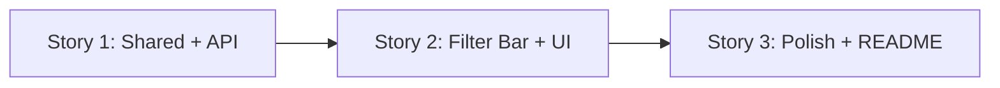

# FloSports Event Explorer -- Story Breakdown

## Guiding Principles (applied to all stories)

- **TDD strictly**: Red-Green-Refactor for every piece of logic. Write the failing test first, then the minimal code to pass, then refactor.
- **Clean Code** (Robert C. Martin): short self-describing functions (<50 lines), self-describing variable names, guard clauses with early returns (Martin Fowler), no nested conditionals.
- **SOLID**: Single responsibility per class/function. Depend on abstractions (DI). Open for extension, closed for modification.
- **DRY**: Extract shared logic. No copy-paste.
- **YAGNI**: No pagination, no Swagger, no NGXS, no global exception filter -- keep it lean. Only add patterns that serve a concrete purpose.
- **DDD** (Eric Evans): Ubiquitous language, bounded context, entities vs value objects, repository as a port/adapter boundary, domain logic in pure functions.
- **GoF patterns** (Gang of Four): Apply where they naturally fit -- Strategy for composable filters, Repository for data access abstraction, Adapter for JSON-to-domain translation, Observer via Angular signals/emitters.
- **Rules**: Follow `[.cursor/rules/nestjs-clean-code.mdc](.cursor/rules/nestjs-clean-code.mdc)` for backend, `[.cursor/rules/angular-clean-code.mdc](.cursor/rules/angular-clean-code.mdc)` for frontend, `[.cursor/rules/nx-monorepo.mdc](.cursor/rules/nx-monorepo.mdc)` for monorepo conventions.
- **All tests green** at the end of each story.

## Design Patterns & DDD Mapping

**DDD concepts used:**

- **Bounded Context**: "Events" -- single context with its own ubiquitous language (`FloEvent`, `LiveStats`, `EventWithStats`, `StreamHealth`)
- **Entity**: `FloEvent` -- has identity (`id`), represents a single sports event
- **Value Objects**: `EventStatus`, `StreamHealth` (enums), `LiveStats`, `EventFilterParams` -- no identity, defined by their attributes
- **Aggregate Root**: `EventWithStats` -- the Event aggregate combines the entity with its optional live stats
- **Repository** (port/adapter): `EventsRepository` interface as the port; `JsonEventsRepository` as the adapter. Directly answers the PRD question "what would change if these were real HTTP services?" -- swap the adapter.
- **Application Service**: `EventsService` orchestrates repository calls + domain logic, no business rules of its own

**GoF patterns used:**

- **Strategy**: Each filter (status, sport, search) is an independent predicate function. They compose via sequential `.filter()` calls -- interchangeable filtering strategies.
- **Repository** (also Fowler's PoEAA): Interface abstracts data access. `JsonEventsRepository` is today's implementation; `HttpEventsRepository` would be tomorrow's.
- **Adapter**: `JsonEventsRepository` adapts raw file I/O into the domain repository interface.
- **Observer**: Angular `output()` / signals -- filter components emit changes, container component observes and reacts.
- **Facade**: Angular `EventsApiService` provides a unified interface over multiple API endpoints (`/api/events`, `/api/sports`).

## Existing scaffold

- Nx 22.5 monorepo: `apps/api` (NestJS 11), `apps/client` (Angular 21), `libs/shared`
- Proxy: `apps/client/proxy.conf.json` routes `/api` to `localhost:3000`
- Testing: Vitest (Angular), Jest (NestJS via webpack)
- Path alias: `@flo-sports/shared` -> `libs/shared/src/index.ts`

## Data

- `flo-events.json`: ~5000 events (`id`, `title`, `sport`, `league`, `status`, `startTime`)
- `live-stats.json`: ~400 records (`eventId`, `viewerCount`, `peakViewerCount`, `streamHealth`, `lastUpdated`)
- Live stats exist only for events with `status === 'live'`, joined on `eventId === id`

---

## Story 1: Shared Models + NestJS Backend API

**Goal:** Shared types, data loading, merging, filtering, and 3 REST endpoints -- all TDD.

### 1a. Domain model in `[libs/shared/src/lib/](libs/shared/src/lib/)`

These are the ubiquitous language types shared across the bounded context:

- **Value Objects** (enums):
  - `EventStatus`: `upcoming | live | completed`
  - `StreamHealth`: `excellent | good | fair | poor`
- **Entity**:
  - `FloEvent` interface: `{ id, title, sport, league, status: EventStatus, startTime }`
- **Value Object**:
  - `LiveStats` interface: `{ eventId, viewerCount, peakViewerCount, streamHealth: StreamHealth, lastUpdated }`
- **Aggregate Root**:
  - `EventWithStats` interface: `FloEvent & { liveStats?: LiveStats }`
- **Filter Value Object**:
  - `EventFilterParams` interface: `{ sport?, status?, search? }`
- Export all from `[libs/shared/src/index.ts](libs/shared/src/index.ts)`

### 1b. NestJS events feature in `apps/api/src/events/`

File structure (feature-based with DDD-informed naming):

```
apps/api/src/events/
  events.module.ts
  events.controller.ts              -- Presentation layer (thin)
  events.controller.spec.ts
  events.service.ts                 -- Application service (orchestrates)
  events.service.spec.ts
  events.repository.ts              -- Repository interface (port)
  json-events.repository.ts         -- Repository implementation (adapter)
  json-events.repository.spec.ts
  event-filter.strategy.ts          -- Strategy: composable filter predicates
  event-filter.strategy.spec.ts
  dto/
    event-filter.dto.ts             -- Query param DTO
```

**Repository (GoF: Repository + Adapter):**

`EventsRepository` -- abstract interface (port):

- `findAllEvents(): FloEvent[]`
- `findAllLiveStats(): LiveStats[]`

`JsonEventsRepository` -- concrete implementation (adapter):

- Loads JSON files, returns typed domain objects
- Injected via NestJS DI; the service depends on the interface, not the implementation (Dependency Inversion)
- Directly answers PRD question: swap to `HttpEventsRepository` for real upstream services

**TDD sequence for `JsonEventsRepository`:**

1. Write test: `findAllEvents()` returns typed `FloEvent[]` from JSON -> implement
2. Write test: `findAllLiveStats()` returns typed `LiveStats[]` from JSON -> implement

**Strategy pattern for filtering (`event-filter.strategy.ts`):**

Pure functions -- each filter is an independent predicate. Compose via chain:

- `filterByStatus(events, status)` -- guard: if no status, return events unchanged
- `filterBySport(events, sport)` -- guard: if no sport, return events unchanged
- `filterBySearch(events, search)` -- guard: if no search, return events unchanged; case-insensitive title match
- `applyFilters(events, filters)` -- composes all three sequentially (no nesting)

**TDD sequence for filter strategies:**

1. Write test: `filterByStatus` with `'live'` returns only live events -> implement
2. Write test: `filterByStatus` with `undefined` returns all events (guard) -> implement
3. Write test: `filterBySport` with `'Wrestling'` returns only wrestling -> implement
4. Write test: `filterBySearch` with `'NCAA'` matches case-insensitively -> implement
5. Write test: `applyFilters` composes all filters -> implement

**Application service (`EventsService`):**

Orchestrates repository + domain logic. No business rules of its own -- delegates:

- `findAll(filters)` -- calls repository, merges stats (Map for O(1) lookup), applies filter strategies
- `findOne(id)` -- calls repository, finds event, merges stats; guard clause throws `NotFoundException` if missing
- `getSports()` -- calls repository, extracts unique sorted sport names

**TDD sequence for `EventsService`:**

1. Write test: `findAll()` returns all events with live stats merged -> implement merging via Map
2. Write test: `findAll({ status: 'live' })` delegates to filter strategy -> verify
3. Write test: `findOne('evt-0003')` returns merged event+stats -> implement
4. Write test: `findOne('nonexistent')` throws `NotFoundException` -> guard clause
5. Write test: `getSports()` returns sorted unique list -> implement

**Controller (thin presentation layer):**

- `GET /api/events?sport=X&status=Y&search=Z` -> delegates to `service.findAll(filters)`
- `GET /api/events/:id` -> delegates to `service.findOne(id)`
- `GET /api/sports` -> delegates to `service.getSports()`

**TDD sequence for `EventsController`:**

1. Write test: GET `/api/events` calls `service.findAll` with parsed query params
2. Write test: GET `/api/events/:id` calls `service.findOne`, returns result
3. Write test: GET `/api/events/:id` returns 404 when service throws `NotFoundException`
4. Write test: GET `/api/sports` calls `service.getSports`

**DTO**: `EventFilterDto` with optional `sport`, `status`, `search` string fields.

### Acceptance criteria

- `GET /api/events?status=live` returns only live events with `liveStats` attached
- `GET /api/events?sport=Wrestling&search=NCAA` filters correctly
- `GET /api/sports` returns deduplicated, sorted list
- `GET /api/events/evt-0003` returns merged event+stats
- `GET /api/events/nonexistent` returns 404
- All service and controller tests pass

---

## Story 2: Angular Frontend -- Filter Bar + Event List

**Goal:** 3 hand-built filter components (no third-party UI libs), event list, wired to API -- all TDD.

### 2a. Infrastructure layer: `EventsApiService` (Facade + Adapter)

Location: `apps/client/src/app/features/events/services/`

- **Facade** (GoF): Provides a single unified interface over multiple API endpoints
- Uses typed `HttpClient` with shared interfaces from `@flo-sports/shared`
- Methods: `getEvents(filters: EventFilterParams)`, `getEvent(id: string)`, `getSports()`

**TDD:**

1. Test: `getEvents()` calls `GET /api/events` with no params -> implement
2. Test: `getEvents({ status: 'live' })` sends `?status=live` -> implement
3. Test: `getSports()` calls `GET /api/sports` -> implement

### 2b. Presentation layer: filter components (standalone, SCSS, OnPush)

File structure (DDD-informed: infrastructure + presentation separation):

```
apps/client/src/app/features/events/
  services/
    events-api.service.ts            -- Infrastructure: Facade over API
    events-api.service.spec.ts
  components/
    toggle/
      toggle.component.ts|html|scss|spec.ts
    search-input/
      search-input.component.ts|html|scss|spec.ts
    sport-dropdown/
      sport-dropdown.component.ts|html|scss|spec.ts
    filter-bar/
      filter-bar.component.ts|html|scss|spec.ts
    event-list/
      event-list.component.ts|html|scss|spec.ts
  events.page.ts|html|scss|spec.ts   -- Container (smart) component
```

**Toggle component** (Observer: emits state changes) -- TDD:

1. Test: renders with `aria-checked="false"` initially -> implement
2. Test: clicking toggles `aria-checked` to `"true"` and emits `true` -> implement
3. Test: keyboard Enter/Space toggles -> implement

**Search input component** -- TDD:

1. Test: renders input element -> implement
2. Test: emits debounced value after typing -> implement (use signals or RxJS debounce)
3. Test: shows clear button when value is non-empty -> implement
4. Test: clicking clear resets value and emits empty string -> implement

**Sport dropdown component** -- TDD:

1. Test: renders closed by default, shows placeholder -> implement
2. Test: clicking opens dropdown, shows options -> implement
3. Test: selecting option emits value, closes dropdown -> implement
4. Test: typing in search input filters visible options -> implement
5. Test: Escape key closes dropdown -> implement
6. Test: click outside closes dropdown -> implement
7. Test: proper ARIA attributes (`role="listbox"`, `aria-expanded`) -> implement

**Filter bar component** (composes child filter components) -- TDD:

1. Test: renders all three filter controls -> implement
2. Test: toggling "Live Only" emits filter with `status: 'live'` -> implement
3. Test: typing search emits filter with `search` param -> implement
4. Test: selecting sport emits filter with `sport` param -> implement

**Event list component** (dumb/presentational):

- Receives `EventWithStats[]` as input
- Displays: title, sport, league, status badge, startTime
- For live events: viewerCount, peakViewerCount, streamHealth badge
- Minimal styling -- PRD says this section can be basic

**Events page** (container/smart component -- Observer pattern):

- Fetches sports list on init for dropdown
- Observes filter changes from filter bar (Observer pattern via Angular `output()`)
- On filter change: calls `EventsApiService.getEvents(filters)`, updates event list
- Uses Angular signals for local state (per angular-clean-code rule, YAGNI -- no NGXS for one page)
- Clean separation: container handles data flow, child components handle presentation

### Acceptance criteria

- Toggle "Live Only" -> only live events with stats displayed
- Typing in search -> debounced API call, results update
- Selecting sport from dropdown -> events filtered by sport
- All filters compose correctly
- All component tests pass

---

## Story 3: Integration, Error Handling, and README

**Goal:** Verify end-to-end flow, handle edge cases, document everything.

### Tasks

- Run `nx serve client` and verify both API and frontend work together through proxy
- Add error handling: loading state, API error display, empty results message
- Verify all tests pass: `nx test api` and `nx test client`
- Write README covering all 7 required sections from the PRD:
  1. Setup instructions (clone, `npm install`, `nx serve client`)
  2. Assumptions (debounce timing, case-insensitive search, no pagination since PRD doesn't require it)
  3. API design (3 endpoints, query param structure, response shapes)
  4. Data loading and merging (in-memory JSON, Map for O(1) stats lookup, what changes for real HTTP upstreams)
  5. Backend decisions (feature-based module, thin controller, pure filter functions)
  6. Trade-offs (what was prioritized, what was skipped, what to add with 2 more hours)
  7. AI tools usage
- Clean commit history

---

## Execution order




Story 1 is a prerequisite for Story 2 (frontend needs the API). Story 3 is final polish after both work.